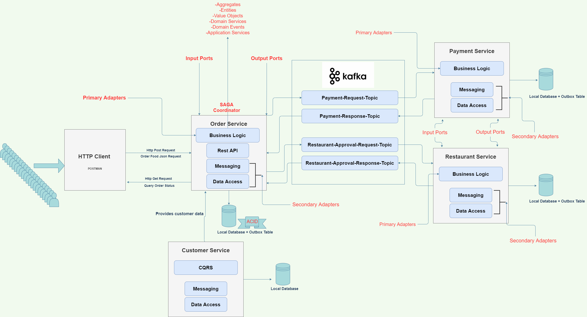

# What we are doing here ? 
    
   - Hexagonal (Clean) Architecture -> Port & Adapter Style

   - Domain Driven Desing (DDD)

   - SAGA Pattern : process & rollback ( compensating transactions )

   - Outbox Pattern : Pulling Outbox Table With Scheduler , Saga Status

        - Cover Failure Scerinarios :
    
            - Ensure idempotency using outbox table in each service 
    
            - Prevent concurrency issues with optimistic looks & DB constaints
    
            - Kepp updating saga and order status for each operation

   - CQRS Pattern : Materialized view & Event Sourcing

   - Relational Database : for ACID and distributed transactional

   - Kafka Messaging Systems for CQRS desing and Microservices Communication

   - Kubernetes And GKE ( Google Kubernetes Engine )